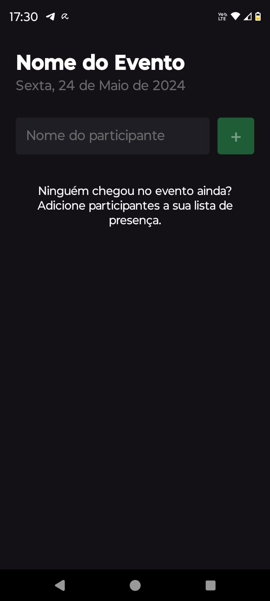
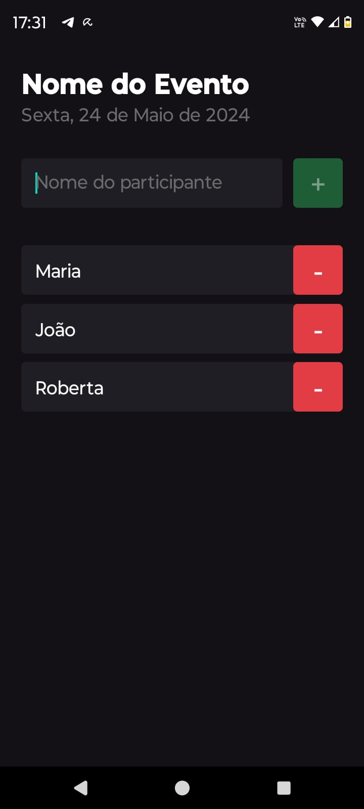

<!-- CABEÇALHO -->

    <h1>
        I'm Here
    </h1>
    

        <a href="#%EF%B8%8F-sobre-o-projeto">Sobre o Projeto</a> •
        <a href="#-funcionalidades">Funcionalidades</a> •
        <a href="#-layout">Layout</a> •
        <a href="#%EF%B8%8F-tecnologias">Tecnologias</a> •
        <a href="#-autor">Autor</a>
    

<!-- SOBRE O PROJETO -->

## 🖥️ Sobre o Projeto

> Projeto desenvolvido durante o módulo de Fundamentos do React Native da formação de React Native da **[Rocketseat](https://www.rocketseat.com.br/)**.

Esse projeto consiste em uma aplicação mobile para gerenciar os participantes presentes em um evento, como uma palestra, workshop, etc.

Projeto realizado com o objetivo de aprender os conceitos mais importantes do React e do React Native, como componentização, estados, imutabilidade e hooks.

<!-- FUNCIONALIDADES -->

## 💡 Funcionalidades

- [x] Adicionar um participante
- [x] Listar os participantes
- [x] Remover um participante
- [x] Verificar se o participante já está na lista

<!-- LAYOUT -->

## 🎨 Layout

  
  

<!-- TECNOLOGIAS -->

## 🛠️ Tecnologias

Para o desenvolvimento desse projeto, as seguintes ferramentas foram utilizadas:

- **[React Native](https://reactnative.dev/)**
- **[TypeScript](https://www.typescriptlang.org/)**
- **[Expo](https://expo.dev/)**

<!-- AUTOR -->

## 👨‍💻 Autor

Marcos Kenji Kuribayashi

 

---

Desenvolvido por Marcos Kenji Kuribayashi 😉
